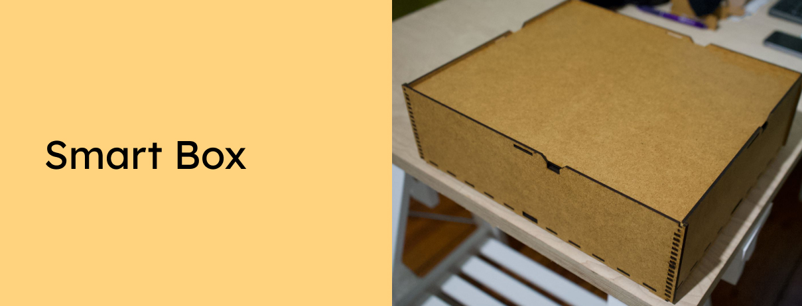

Lasercut yourself a smart storage box! A box with flexible compartments and a lock. A box that can be opened easily from all four sides and safely stacked.

Want to support the development and stay updated?

 

## Instrutions
Lasercut all the different parts on 3mm thick MDF plates and connect them like in the 3D model here: [https://www.tinkercad.com/things/2Ry6HoTNIsI ](https://www.tinkercad.com/things/2Ry6HoTNIsI)